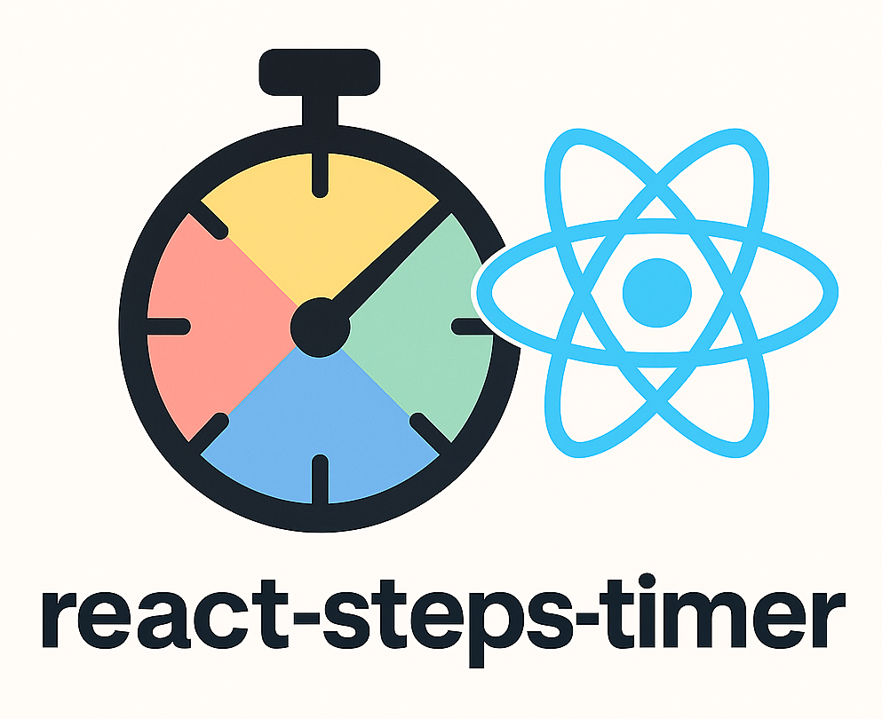

# react-steps-timer

A flexible React hook and context provider for timing total duration and multiple parallel steps in your workflows.





> [!WARNING]
> This package is in active development and may have bugs or unexpected behavior. If you encounter any issues, please [open an issue](https://github.com/yourusername/react-steps-timer/issues) or submit a PR to help improve it.


## Features

- **Track total elapsed time** of any process
- **Measure multiple named steps in parallel**, each with a user-provided ID
- **Control** timer behavior with `start()`, `pause()`, `resume()`, `stop()`, `startStep()`, `endStep()`, and `reset()`
- **Share** the same timer instance across your component tree via Context (no prop drilling)

## Installation

```bash
npm install react-steps-timer
# or
yarn add react-steps-timer
```

## Getting Started

Wrap your application (or part of it) in the provider:

```tsx
import React from 'react'
import { StepsTimerProvider } from 'react-steps-timer'

export function App() {
  return (
    <StepsTimerProvider>
      {/* your components */}
    </StepsTimerProvider>
  )
}
```

Then use the hook anywhere inside:

```tsx
import { useStepsTimer } from 'react-steps-timer'

export function Demo() {
  const { totalTime, start, startStep, endStep, stop, pause, resume, reset, activeSteps, stepTimes } = useStepsTimer()

  React.useEffect(() => {
    start()
    startStep('fetchData')
    fetch('/api/data')
      .then(() => endStep('fetchData'))
  }, [])

  return (
    <div>
      <p>Total: {totalTime} ms</p>
      <p>Active steps: {JSON.stringify(activeSteps)}</p>
      <p>Completed steps: {JSON.stringify(stepTimes)}</p>
      <button onClick={stop}>Stop All</button>
      <button onClick={reset}>Reset</button>
    </div>
  )
}
```

## API

### `<StepsTimerProvider>`
Provide context for steps timer. Wrap at the root of any component tree that needs timing.

### `useStepsTimer()`
Returns an object:

| Property/Method | Type          | Description                                         |
| --------------- | ------------- | --------------------------------------------------- |
| `totalTime`     | `number`      | Total elapsed time in milliseconds                  |
| `running`       | `boolean`     | `true` if timer is active                           |
| `activeSteps`   | `Record<string, number>` | Map of active step IDs to their current elapsed times |
| `stepTimes`     | `StepTime[]`  | Array of finished steps `{ id, start, end, duration }` |
| `start()`       | `() => void`  | Start the timer from zero                           |
| `pause()`       | `() => void`  | Pause timer and active steps                        |
| `resume()`      | `() => void`  | Resume timer and active steps                       |
| `startStep(id)` | `(id: string) => void` | Begin timing step with given ID            |
| `endStep(id)`   | `(id: string) => void` | End timing step with given ID               |
| `stop()`        | `() => void`  | Stop and record all active steps                    |
| `reset()`       | `() => void`  | Reset timer and clear all step data                 |

## Development

Clone the repo and install dependencies:

```bash
git clone https://github.com/your-username/react-steps-timer.git
cd react-steps-timer
npm install
```

Build and test:

```bash
npm run build
npm test
```

## License

[MIT](LICENSE)
